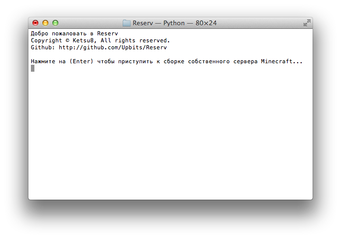
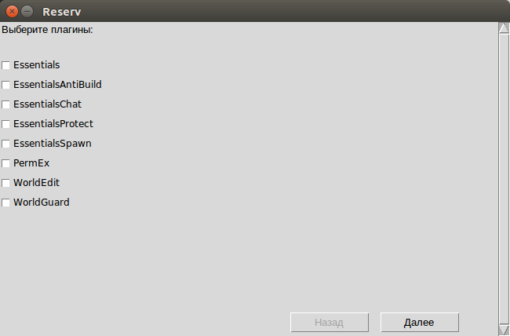

## Reserv Lite

GUI версия утилиты отличается от Lite наличием графического интерфейса. В Lite версии его нет.
Запустить Lite-утилиту можно используя командную строку в Windows или терминал в macOS и Linux ведя эту команду:



Linux и macOS:
```sh
python3 startlite.py
```
В Windows будет достаточно просто выполнить двойной клик по файлу lite.py или открыть его в интерпретаторе Python 3, но также можно запустить используя командную строку. Делается это так:
* Шаг 1
```sh
cd <папка с проектом>
```

* Шаг 2
```sh
python startlite.py
```
Готово!

## Reserv GUI

Утилита имеющая графический интерфейс, перенемая все функции из Lite версии и дополняя их.
> Извеняемся, но macOS временно неподдерживается.



Для Windows:
* Шаг 1
```sh
cd <папка с проектом>
```

* Шаг 2
```sh
python startgui.pyw
```

А для Linux используйте:
```sh
python3 startgui.pyw
```
